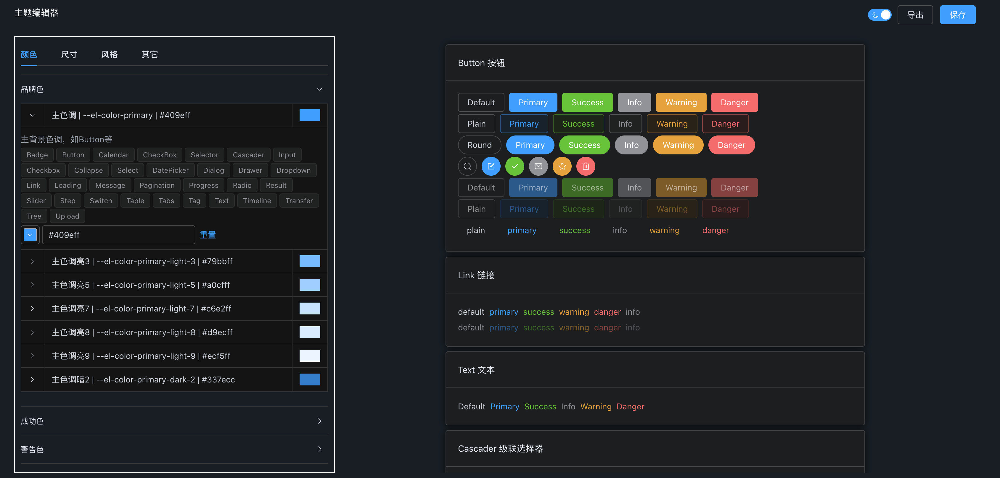
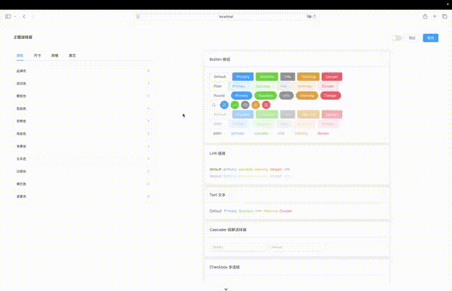
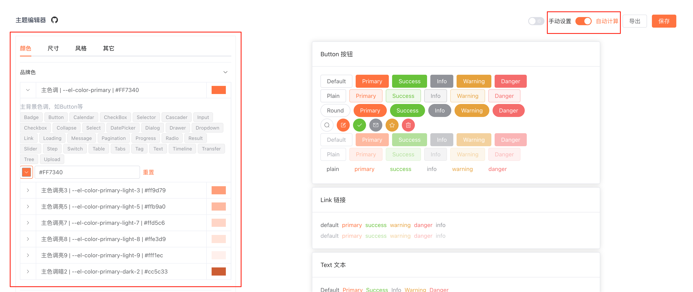

# Element Plus Theme Editor

English | [简体中文](README.zh.md)

A theme variable editor for Element Plus component library, helping designers quickly adjust and preview Element Plus component styles.

## Project Background

This project aims to solve the problem of frequent theme changes by designers. By providing a visual theme editing tool, designers can independently adjust theme variables and export configurations, reducing the workload of developers.

## Tech Stack

- Vue 3
- TypeScript
- Tailwind CSS
- Element Plus

## Features

### 1. Theme Variable Editing

The interface is divided into two sections: variable editing area on the left and component preview area on the right. Supports editing of the following variable types:

- Color variables
- Size variables
- Style variables
- Other variables


### 2. Real-time Preview

After editing variables, the component area on the right will immediately apply the new theme styles, allowing designers to intuitively view the effects.

### 3. Light/Dark Theme Toggle

Supports quick switching between light and dark themes, making it convenient for designers to preview effects in different scenarios.



### 4. Export Configuration

Supports exporting edited theme variables as a CSS file, making it easy for developers to use directly.



The exported CSS variable file example:

```
--el-color-primary: #FF8340;
```

### 5. Automatic Color Value Calculation

Provides a toggle to automatically compute derivative color values from the primary color, reducing manual input. When enabled,
related color shades are generated for you.



## Quick Start

### Install Dependencies

```sh
npm install
```

### Start Development Server

```sh
npm run dev
```

Access URL: http://localhost:5173/index.html#/theme/component

### Build for Production

```sh
npm run build
```

## Development

### Recommended IDE Setup

- [VSCode](https://code.visualstudio.com/) + [Volar](https://marketplace.visualstudio.com/items?itemName=Vue.volar) (and disable Vetur)

### Code Linting

```sh
npm run lint
```

## License

[MIT](LICENSE)
