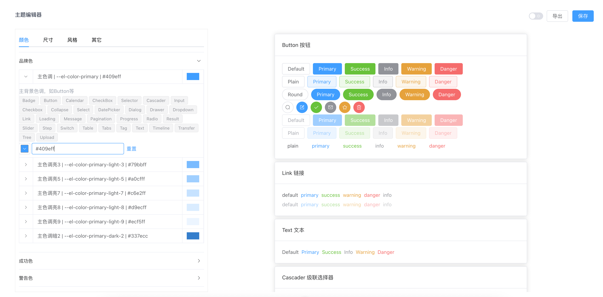
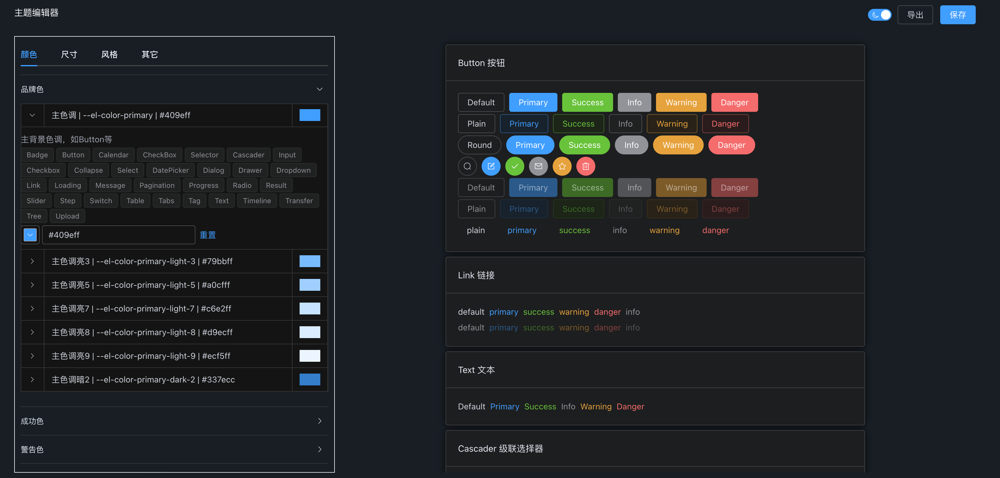
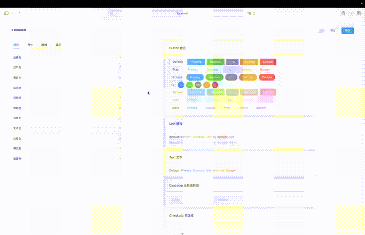

# Element Plus Theme Editor

[English](README.md) | 简体中文

Element Plus 主题变量编辑工具，帮助设计师快速调整和预览 Element Plus 组件的主题样式。

## 项目背景

本项目旨在解决设计人员频繁更换配色主题的问题。通过提供可视化的主题编辑工具，让设计师能够自主调整主题变量并导出配置，减少开发人员的工作负担。

## 技术栈

- Vue 3
- TypeScript
- Tailwind CSS
- Element Plus

## 功能特性

### 1. 主题变量编辑

左侧为变量编辑区，右侧为组件展示区。支持以下类型的变量编辑：

- 颜色变量
- 尺寸变量
- 风格变量
- 其他变量



### 2. 实时预览

编辑变量后，右侧组件区域会实时应用新的主题样式，方便设计师直观地查看效果。

### 3. 黑白主题切换

支持在亮色和暗色主题之间快速切换，方便设计师在不同场景下预览效果。



### 4. 导出配置

支持将编辑后的主题变量导出为 CSS 文件，方便开发人员直接使用。



导出的css变量文件示例：

```
--el-color-primary: #FF8340;
```

### 5. 自动计算色值

提供自动计算与手动设置的切换，启用后会根据基础色值生成衍生颜色，减少手动输入，提升调色效率。


## 快速开始

### 安装依赖

```sh
npm install
```

### 启动开发服务器

```sh
npm run dev
```

访问地址：http://localhost:5173/index.html#/theme/component

### 构建生产版本

```sh
npm run build
```

## 开发相关

### 推荐开发环境

- [VSCode](https://code.visualstudio.com/) + [Volar](https://marketplace.visualstudio.com/items?itemName=Vue.volar) (并禁用 Vetur)

### 代码检查

```sh
npm run lint
```

## 许可证

[MIT](LICENSE)
